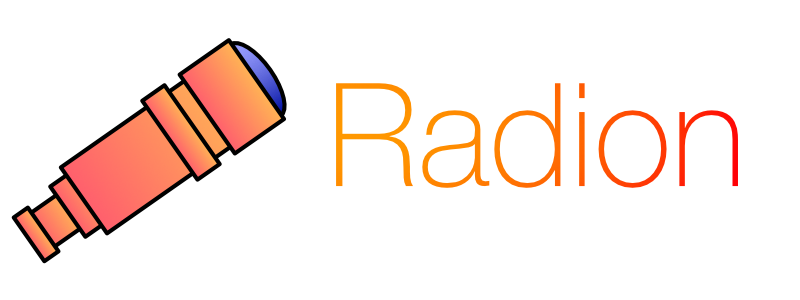
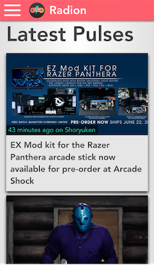
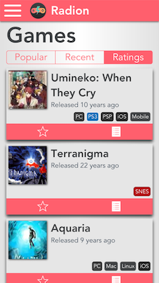
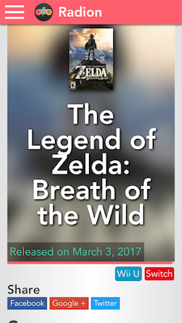
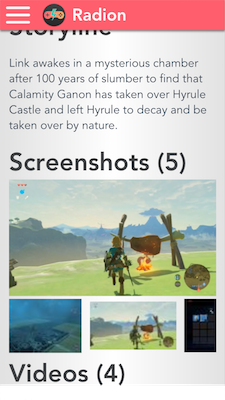
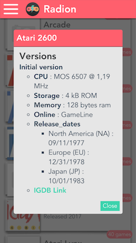
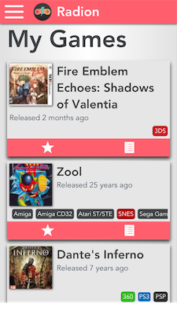

A web client for the [Internet Game Database](https://igdb.js)

[](https://travis-ci.org/Gramatiik/radion-vue)
[](https://coveralls.io/github/Gramatiik/radion-vue?branch=master)

## Features
- Browse and search **Games**
- Build a list of your **Favourite Games**
- Browse **Platforms**
- Read the news with **Pulse**, with **Notifications**
- Find new games with **Discover**

## Screenshots







## Other platforms

Radion is also available for IOS and Android, check out these projects !
- [Radion IOS](https://github.com/istornz/Radion-iOS)
- [Radion Android](https://github.com/Psykotik/Radion-Android)

## Compatibility

Tested on the following browsers :

| IE | Edge | Firefox | Chrome | Safari | Opera | Android Browser |
|:--:|:----:|:-------:|:------:|:------:|:-----:|:---------------:|
| 11 |  13+ |   52+   |   57+  |   9+   |  43+  |      4.4.4+     |

## Installation and development

``` bash
# install dependencies
npm install

# serve with hot reload at localhost:8080
npm run dev

# build for production with minification
npm run build

# build for production and view the bundle analyzer report
npm run build --report

# run unit tests
npm run unit

# run all tests
npm test
```

For detailed explanation on how things work, checkout the [guide](http://vuejs-templates.github.io/webpack/) and [docs for vue-loader](http://vuejs.github.io/vue-loader).

## Licence

[MIT](LICENCE.md)
